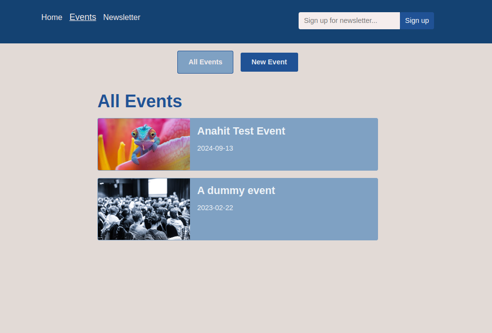
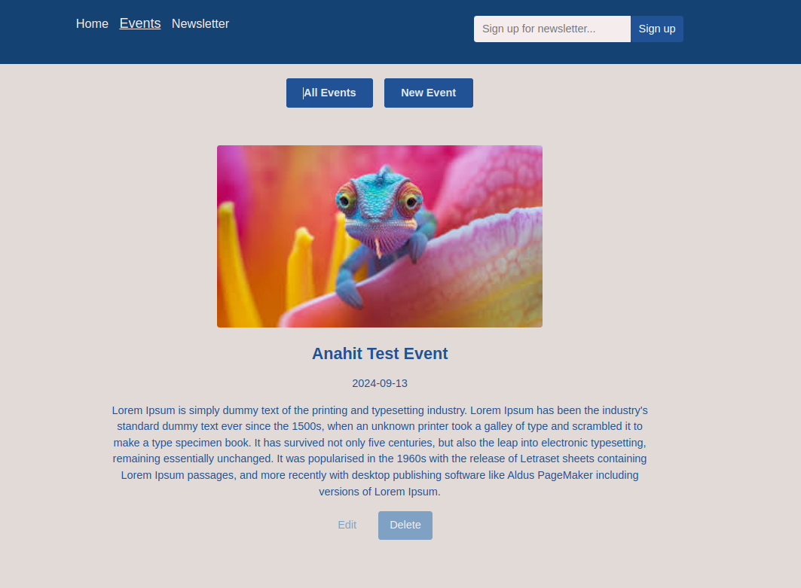
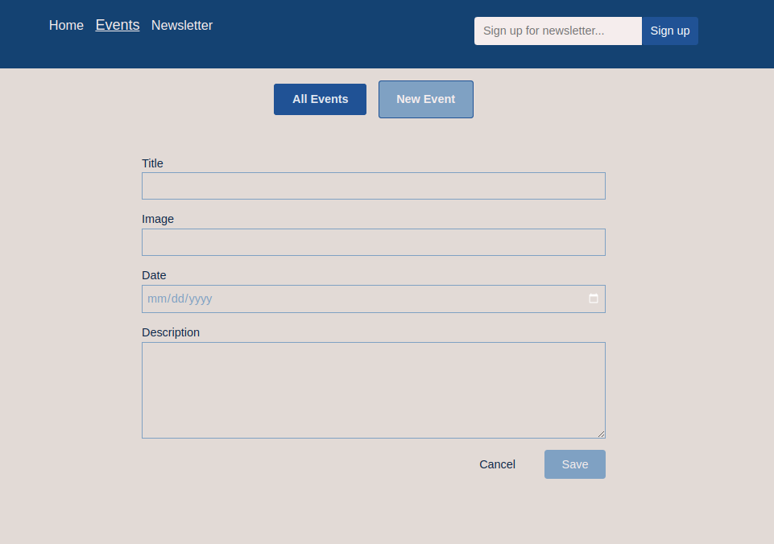

<br />
<br />
<br />

## Events App
Multi-Page SPA with React Router. Can fetch events from backend, save and edit events; <br> (Used: Routes, Nested Routes, Link, NavLink; Methods loader() and action(), json() and redirect; Hooks: useRouteLoaderData, useRouteError, useLoaderData,useActionData, useNavigate, useNavigation, useSubmit; defer, Await, Suspense)

## Install and Run Backend

```sh
cd backend
```

```sh
npm install
```

```sh
npm start
```

## Install and Run Frontend

```sh
cd frontend
```

```sh
npm install
```

```sh
npm start
```